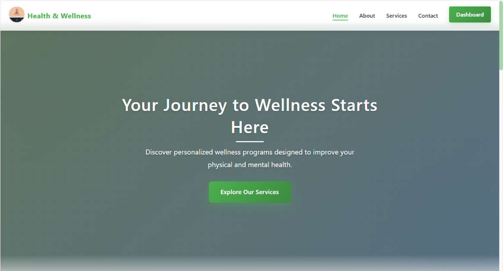
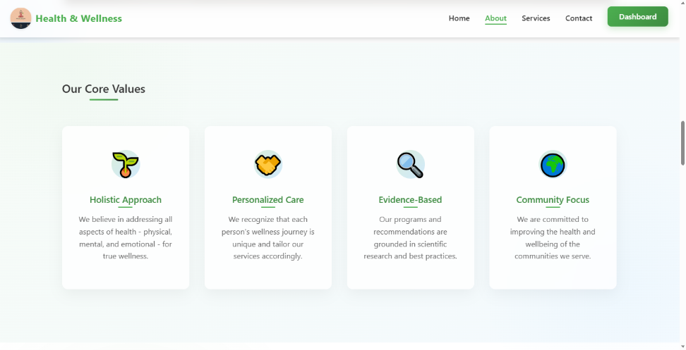
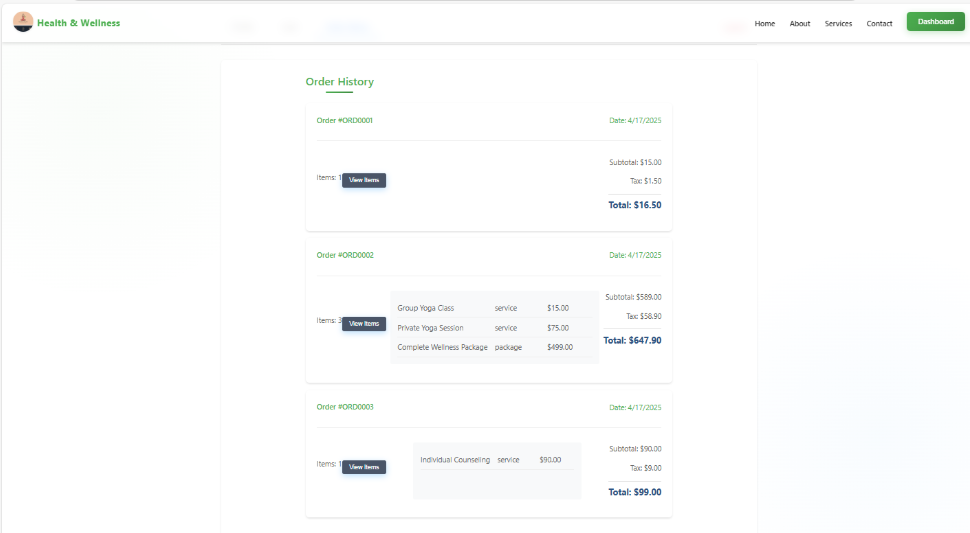
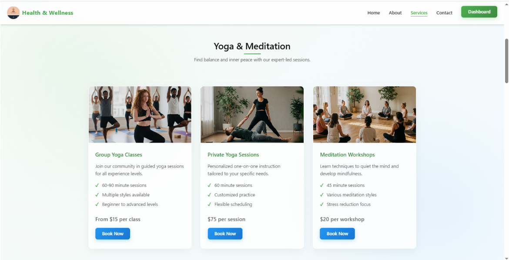
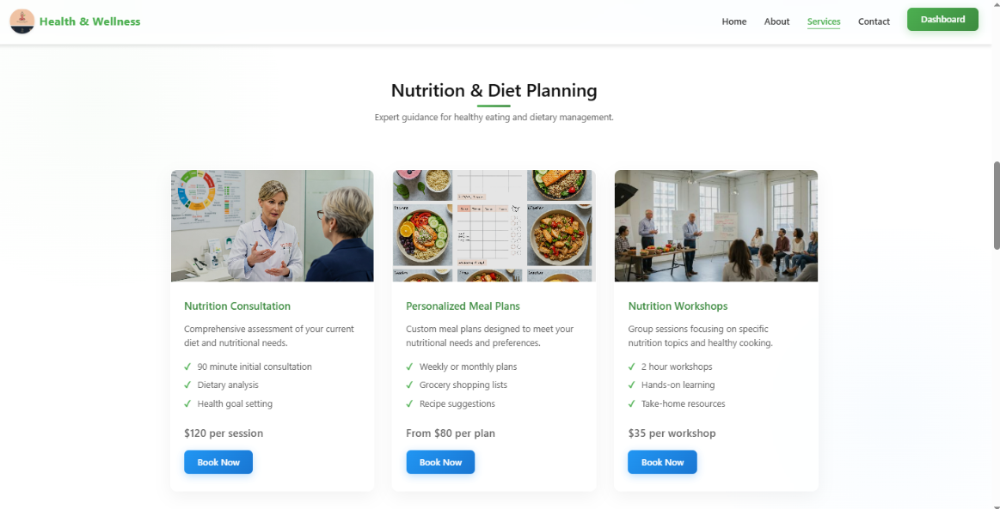
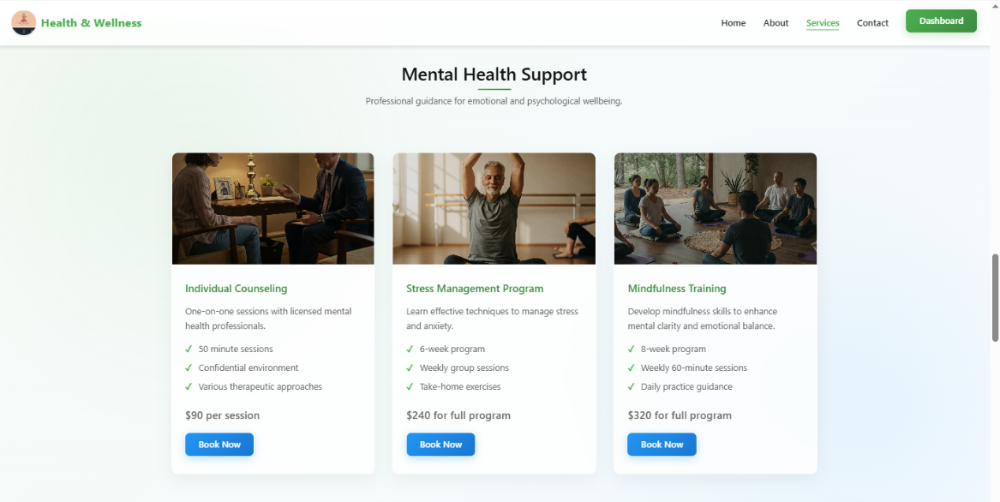
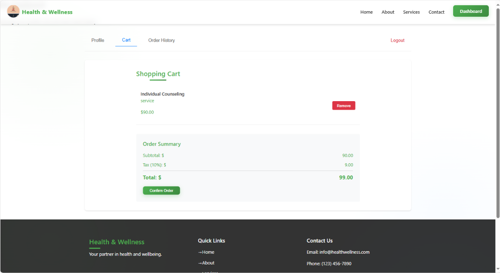

<div align="center">

# 🌿 Health & Wellness Application

[](https://choosealicense.com/licenses/mit/)
[](https://nodejs.org/)
[](https://www.mongodb.com/)
[](http://makeapullrequest.com)

A comprehensive MERN stack application designed to revolutionize your wellness journey with seamless service browsing, smart purchases, and intuitive health management.

[Live Demo](#) | [Report Bug](../../issues) | [Request Feature](../../issues)

</div>

## 📸 Project Screenshots

<div align="center">

### 🏠 Homepage


### 👤 About Us


### 👤 User Dashboard


### 🛍️ Services Marketplace




### 🛒 Shopping Cart


</div>

## ✨ Key Features

- 🔐 **Secure Authentication System**
  - User registration and login
  - JWT-based authentication
  - Role-based access control

- 🛍️ **Rich Shopping Experience**
  - Browse wellness services and products
  - Advanced filtering and search
  - Real-time availability updates

- 🛒 **Smart Cart Management**
  - Add/remove items seamlessly
  - Save for later functionality
  - Dynamic price calculations

- 👤 **User Dashboard**
  - Personalized user profiles
  - Purchase history tracking
  - Wellness journey analytics

- 📱 **Responsive Design**
  - Mobile-first approach
  - Cross-browser compatibility
  - Intuitive user interface

## 🚀 Getting Started

### Prerequisites

Ensure you have the following installed on your system:

- Node.js (v14 or higher)
- MongoDB (v4.4 or higher)
- npm (Node Package Manager)

### System Requirements

- **OS**: Windows/Mac/Linux
- **Memory**: 4GB RAM minimum
- **Storage**: 1GB free space

## Installation

1. Clone the repository:
```bash
git clone <repository-url>
cd health-wellness-app
```

2. Install dependencies for the server and client:
```bash
npm run install-all
```

3. Create a `config.env` file in the `server/config` directory with the following variables:
```
PORT=5000
MONGODB_URI=mongodb://localhost:27017/health-wellness
JWT_SECRET=your_jwt_secret_key_here
JWT_EXPIRE=30d
NODE_ENV=development
```

## Running the Application

1. Start the development server:
```bash
npm run dev
```

This will start both the backend server and the frontend client concurrently.
- Backend server runs on http://localhost:4000
- Frontend client runs on http://localhost:3000

## API Endpoints

### Authentication
- POST /api/auth/register - Register a new user
- POST /api/auth/login - Login user

### Products
- GET /api/products - Get all products
- GET /api/products/:id - Get product by ID
- POST /api/products - Create a new product (Admin only)
- PUT /api/products/:id - Update product (Admin only)
- DELETE /api/products/:id - Delete product (Admin only)

### Orders
- GET /api/orders - Get user's orders
- POST /api/orders - Create a new order
- GET /api/orders/:id - Get order by ID
- PUT /api/orders/:id - Update order status

## 🔑 Demo Credentials

| User Type | Email | Password |
|-----------|-------|----------|
| Admin | admin@example.com | admin123 |
| Regular User | user@example.com | user123 |

## 🤝 Contributing

Contributions make the open-source community an amazing place to learn, inspire, and create. Any contributions you make are **greatly appreciated**.

1. Fork the repository
2. Create your feature branch (`git checkout -b feature/AmazingFeature`)
3. Commit your changes (`git commit -m 'Add: some AmazingFeature'`)
4. Push to the branch (`git push origin feature/AmazingFeature`)
5. Open a Pull Request

## 📝 License

Distributed under the MIT License. See `LICENSE` for more information.

## 👏 Acknowledgments

- [Node.js](https://nodejs.org/)
- [React.js](https://reactjs.org/)
- [MongoDB](https://www.mongodb.com/)
- [Express.js](https://expressjs.com/)
- [Material-UI](https://mui.com/)

## 📧 Contact

Project Link: [https://github.com/Spectra-soul/health-wellness-app](https://github.com/Spectra-soul/health-wellness-app)

---

<div align="center">

Made with ❤️ for a healthier world

</div>